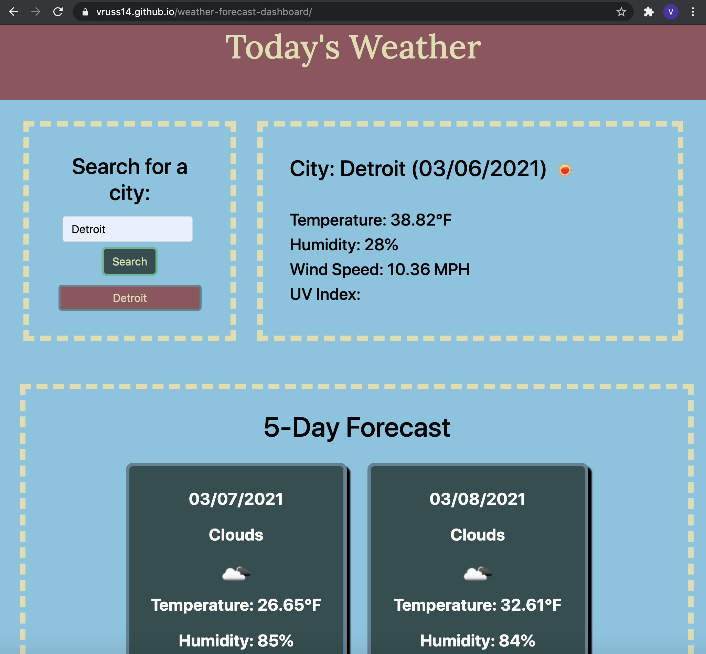

# Weather Forecast Dashboard

## Description

For this project, I designed a fully functional web application that fetches data from the OpenWeatherMap API. When the user searches for a particular city that is listed in the API, current weather conditions for the city appear on the page, along with a five-day forecast for the city.

Current weather data includes the city's name, the date, an icon that is reflective of current weather conditions, the temperature, the humidity, the wind speed, and the UV index. Part of my JavaScript code allows for the background color of the UV index data to change based on whether the UV index is mild, moderate, or severe.

The five-day forecast includes the date, the projected weather conditions, an icon reflective of projected weather conditions, and projected values for temperature and humidity.

After a user completes a search, a button is dynamically created via JavaScript. If one of these previous search buttons are clicked, the data for that city will again be fetched from the API.

I faced a few challenges when creating this project, one of which was learning more about event delegation so the dynamically generated buttons that were not present during page load could function properly. I also ran into a few issues with local storage and making sure that buttons were being appended to the right part of the document.

An extra feature that I created was day and night classes for the application. When a user views the application during the day, then the color scheme is bright and colorful and the header says "Today's Weather." When the user views the application at night, the application switches CSS classes to dark mode and the header says "Tonight's Weather."

One of my favorite things I learned through this project was understanding how to use the modulus operator with great precision so that I could select the right data from the API for the five-day forecast. The array in the API consisted of a list of 40 objects, one for every three hours. By using the filter method and the modulus operator, I was able to select the correct five objects I wanted to display on the application.

Please find the deployed application here: https://vruss14.github.io/weather-forecast-dashboard/

## Installation

No installation steps are required to view this project. To view the front-end application, visit the URL above. The application's source code can be found on GitHub here: https://github.com/vruss14/weather-forecast-dashboard

## Usage

This web application includes responsive design features and can be viewed on all devices.

Below is a screenshot of the deployed application:

## Credits

Valerie Russell built the HTML, CSS, and JavaScript for the application's functionality. She also wishes to thank the learning assistant team on Bootcamp Spot for their valuable insights to her questions.